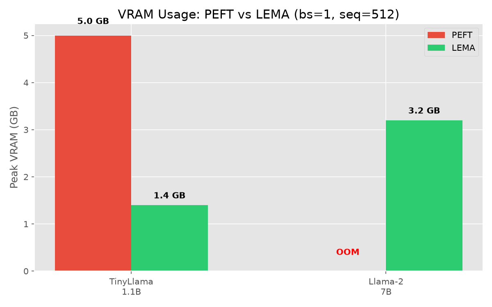
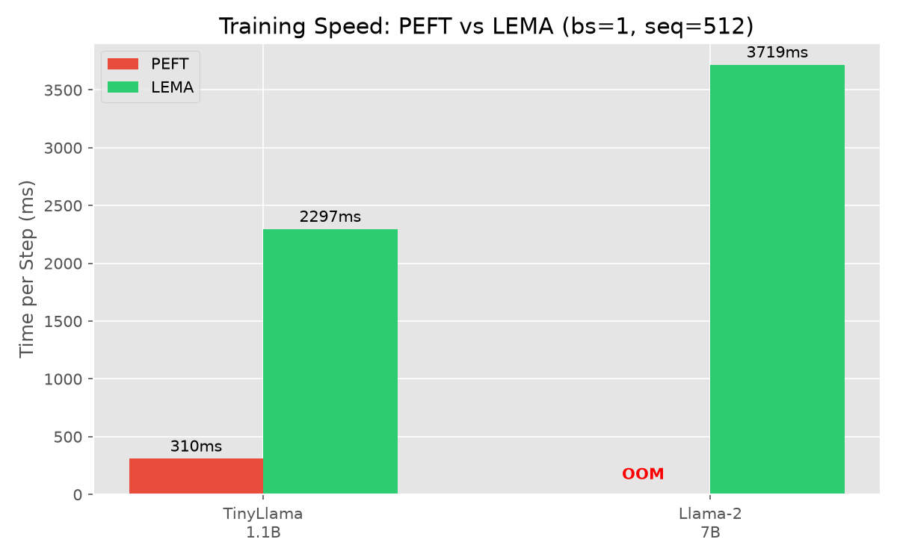

# LEMA: Layer-wise Efficient Memory Abstraction

**Virtualize GPU VRAM for LLM Fine-Tuning**

LEMA is a framework for fine-tuning Large Language Models on GPUs where model size exceeds available VRAM. By treating model weights as addressable binary segments and implementing a **Triple-Buffer Strategy** (Disk → RAM → VRAM) with async prefetching, LEMA allows training 7B+ models on GPUs with as little as 16GB VRAM.

## Key Performance (Tesla T4 — 14.6 GB)

| Model | Config | PEFT VRAM | LEMA VRAM | LEMA Step |
|---|---|---|---|---|
| **TinyLlama 1.1B** | bs=1, seq=512 | 5.0 GB | **1.4 GB** | 2297 ms |
| **TinyLlama 1.1B** | bs=8, seq=512 | OOM | **3.5 GB** | 21087 ms |
| **Llama-2 7B** | bs=1, seq=128 | OOM | **2.9 GB** | 3920 ms |
| **Llama-2 7B** | bs=2, seq=512 | OOM | **3.8 GB** | 4920 ms |
| **Llama-2 7B** | bs=8, seq=512 | OOM | **6.6 GB** | 12816 ms |
| **Llama-2 7B** | seq=2048, bs=1 | OOM | **6.3 GB** | 8414 ms |

PEFT OOMs on Llama-2 7B at every configuration on a 14.6 GB T4. LEMA trains at **2.9–6.6 GB** — under half the VRAM — across all batch sizes and up to 2048 sequence length.

 | 
:---: | :---:
VRAM Usage (bs=1, seq=512) | Training Speed (bs=1, seq=512)

[Full benchmark results](docs/BENCHMARK_RESULTS.md) — VRAM stability, long sequence headroom, C++ backend comparison, and full scaling matrix.

## Fine-tuned Model (PoC)

Successfully fine-tuned `NousResearch/Llama-2-7b-hf` on a custom chat template using an earlier version of LEMA. Available at [huggingface.co/Pomilon/LEMA-llama-2-7b](https://huggingface.co/Pomilon/LEMA-llama-2-7b).

## Features

- **Triple-Buffer Pipeline**: Disk → pinned RAM → VRAM with async prefetching hides PCIe latency.
- **Multi-file Support**: Works directly with HuggingFace sharded `.safetensors` (no longer requires monolithic conversion).
- **C++/Python Backend**: Explicit toggle (`backend="auto" | "cpp" | "python"`).
- **Auto Flight Check**: Benchmarks your hardware and auto-tunes `prefetch_distance` and strategy.
- **5 Model Architectures**: Llama, Mistral, Mixtral (MoE), GPT-2, LFM2 (MoE).
- **Selective Full Fine-Tuning**: Train real model weights (no LoRA) on any selection — attention projections of the last K layers, embeddings, or the entire model — with fp32 optimizer states virtualized into RAM (mmap fallback) the same way weights are.
- **Automatic Checkpointing**: Interval-based saving of LoRA adapters or full-FT delta + optimizer states.
- **Module Pool**: Sliding-window module recycling keeps VRAM constant regardless of model depth.

## Installation

```bash
git clone https://github.com/Pomilon/LEMA.git
cd LEMA
pip install -e .                    # with C++ extension (if CUDA + nvcc available)
pip install -e . --no-cuda-ext     # pure Python only
```

Requires Python ≥ 3.10, PyTorch ≥ 2.0, CUDA-capable GPU.

## Quick Start

```python
import torch
from lema import LemaConfig, LemaModel, MemoryStrategy

config = LemaConfig(
    model_name_or_path="NousResearch/Llama-2-7b-hf",
    strategy=MemoryStrategy.STREAMING,
    backend="auto",              # "auto" | "cpp" | "python"
    lora_rank=16,
    gradient_checkpointing=True,
)

model = LemaModel(config)        # auto-downloads from HF Hub if needed
model.initialize_lora()

optimizer = torch.optim.AdamW(model.get_trainable_parameters(), lr=1e-4)
trainer = model.get_trainer(optimizer)

input_ids = torch.randint(0, 32000, (1, 512)).cuda()
logits, loss = trainer.train_step(input_ids, labels=input_ids)
```

## Selective Full Fine-Tuning

Instead of LoRA adapters, LEMA can train the real model weights directly — a subset of your choosing — using the same VRAM-virtualizing pipeline. Optimizer states and gradient accumulation are fp32 and live in RAM (with an optional mmap disk backend), so even whole-model training stays off-VRAM.

```python
from lema import LemaConfig, LemaModel, MemoryStrategy

config = LemaConfig(
    model_name_or_path="NousResearch/Llama-2-7b-hf",
    strategy=MemoryStrategy.STREAMING,
    training_mode="selective_full",      # instead of LoRA
    trainable_modules=["q_proj", "k_proj", "v_proj", "o_proj"],
    trainable_layers=["last:4"],         # last 4 decoder layers
    learning_rate=1e-4,
    save_steps=500,
    output_dir="checkpoints",
)

model = LemaModel(config)                 # no initialize_lora() needed
trainer = model.get_trainer()             # optimizer handled internally (per-layer AdamW)

logits, loss = trainer.train_step(input_ids, labels=input_ids)
```

**Selection syntax** (`trainable_modules` × `trainable_layers`):

| `trainable_modules` | `trainable_layers` | Result |
|---|---|---|
| `["q_proj","k_proj","v_proj","o_proj"]` | `["last:4"]` | Attention projections of the last 4 layers |
| `["c_attn"]` | `["first:2"]` | GPT-2 attention of the first 2 layers |
| `[]` | `["emb","head"]` | Embeddings + LM head only |
| `[]` | `[]` | **Whole model** (all weights, LOMO-style) |

`trainable_modules` entries are suffix matches against parameter names; `trainable_layers` accepts `"last:K"`, `"first:K"`, explicit layer IDs, `"emb"`, and `"head"`.

**Checkpoints & serving:** training saves a small fp32 **delta** (`updated − original`) plus optimizer state. Restore with `LemaModel.from_pretrained` (weights + optimizer), or produce a servable full model with `merge_delta`:

```python
from lema._utils._conversion import merge_delta
merge_delta(base_safetensors, "checkpoints/checkpoint-500/delta.safetensors", "merged.safetensors")
```

## TensorStore: Unified Streaming Core

All streaming — weights, optimizer states, gradient accumulators, and the KV cache — runs through one `TensorStore`: a slot-pool address space of tensor streams, each with a configurable residency policy. VRAM is split per-kind by a target-based `BudgetEngine` (tuner proposes, explicit overrides win), so you control how much of each kind stays in VRAM vs RAM vs disk.

```python
config = LemaConfig(
    model_name_or_path="gpt2",
    strategy=MemoryStrategy.STREAMING,
    weights_vram="auto",      # "auto" | fraction e.g. "0.3" | absolute e.g. "4.0GB"
    kv_vram="2.0GB",
    target_step_time_ms=250,  # budget engine minimizes VRAM to meet this
    kv_chunk_size=8192,       # tokens per KV chunk
)
```

**Long context & KV-cached generation:** when the sequence exceeds one KV chunk, attention runs chunk-by-chunk (exact, fp32 online softmax) with KV streamed per-layer through the store — enabling 128k+ context on consumer VRAM. `generate_kv` uses a real KV cache instead of the O(n²) re-forward loop:

```python
model.generate_kv(prompt, tokenizer, max_new_tokens=200, kv_chunk_size=8192)
```

Chunked attention and KV-cached generation are supported on **all adapters**: GPT-2, Llama, Mistral, Mixtral, and LFM2 (MoE). Generation runs in eval mode so outputs are deterministic.

See [docs/ARCHITECTURE.md](docs/ARCHITECTURE.md) and [docs/BENCHMARK_RESULTS.md](docs/BENCHMARK_RESULTS.md) for the full design and T4 validation.

## Quantization

All four memory classes LEMA moves — streamed weights, full-FT optimizer states, gradient accumulators, and the KV cache — can be quantized per-class via four config fields:

| Field | Allowed values | Savings vs baseline |
|---|---|---|
| `weights_bits` | `None`/`0` (off), `8`, `4` | int8 ≈ 2×; int4 ≈ 4× on weight disk/RAM (fp16 → 8/4-bit) |
| `opt_state_bits` | `None`/`0` (off), `8` | ≈ 4× on Adam moments (fp32 → int8) |
| `grad_acc_bits` | `None`/`0` (off), `8` | ≈ 4× on gradient accumulators (fp32 → int8) |
| `kv_bits` | `None`/`0` (off), `8` | ≈ 2× on the KV cache (fp16 → int8) |

```python
config = LemaConfig(
    model_name_or_path="NousResearch/Llama-2-7b-hf",
    weights_bits=8,        # int8 streamed weights (4 = int4, weights only)
    opt_state_bits=8,      # int8 Adam moments in full-FT
    grad_acc_bits=8,       # int8 gradient accumulators
    kv_bits=8,             # int8 KV cache chunks
)
```

Weights are quantized and packed in the RAM staging buffer and dequantized into the VRAM execution slot at consumption, so the disk and RAM footprint shrinks while compute stays at full precision. Full-FT optimizer states and accumulators stay quantized in RAM (including the mmap disk backend) and are dequantized only inside the per-layer AdamW step. The KV cache stores int8 values with a dynamic per-chunk scale.

**Trade-offs:** int8 keeps training output within ~1% of fp16 — quantized weight relative error < 1e-2, forward max-diff < 0.1, and train loss within 0.2 of the fp16 baseline (see `tests/test_quant_streaming.py`). int4 weights trade more precision for 4× weight savings. The quantize/dequantize passes add a small per-step time cost.

## Documentation

- [**Benchmark Results**](docs/BENCHMARK_RESULTS.md): Full VRAM and throughput comparison.
- [**API Reference**](docs/API_REFERENCE.md): Complete class and method specifications.
- [**User Guide**](docs/USER_GUIDE.md): Model preparation, conversion, and tips.
- [**Architecture**](docs/ARCHITECTURE.md): Deep dive into the memory pipeline.

## License

MIT License — Copyright (c) 2026 Pomilon
