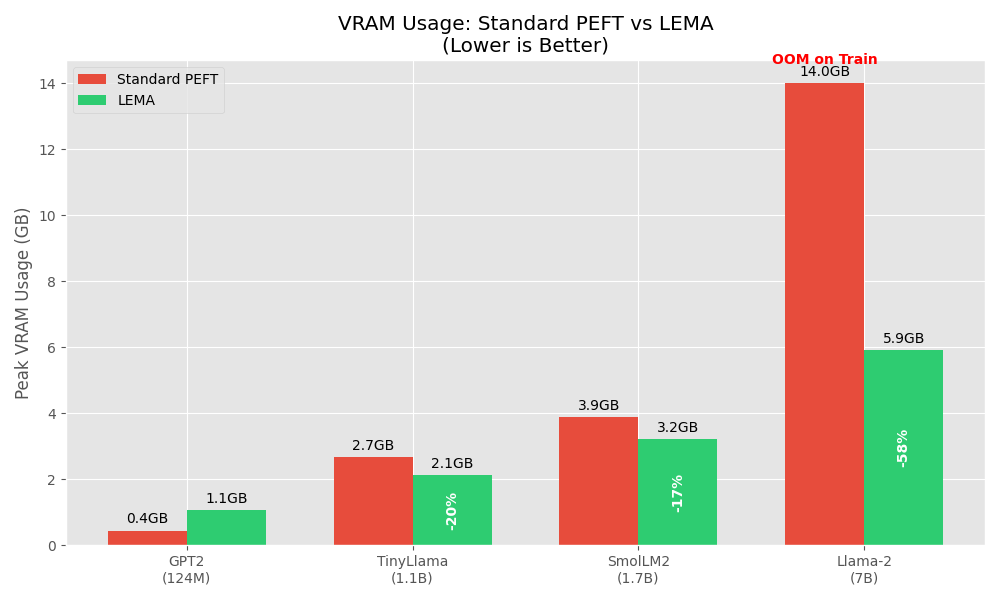
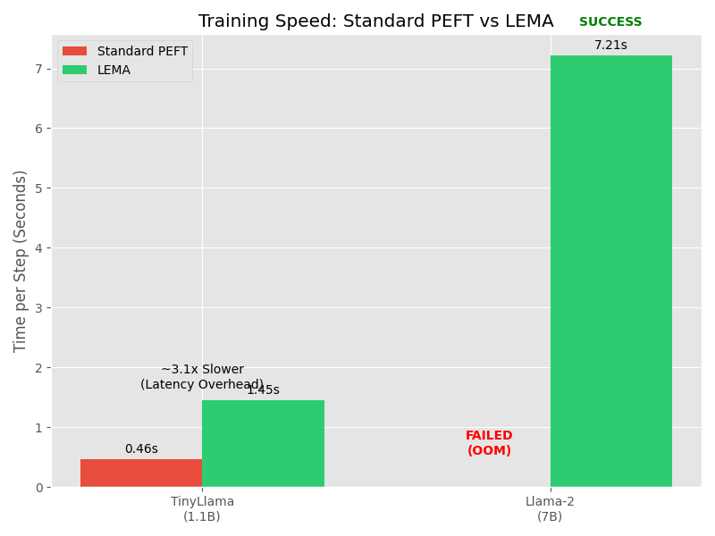

# LEMA Benchmark Results (v0.7 - Release Candidate)

Benchmarks were performed on **Kaggle (Tesla P100 GPU, 16GB VRAM)**.
Comparisons were made between **Standard PEFT (LoRA)** and **LEMA (Streaming Strategy)**.

## 1. VRAM Usage (Memory Efficiency)

LEMA demonstrates significant VRAM savings, particularly for larger models where the overhead of optimization states and activations usually causes OOM errors.

### Detailed Metrics

| Model | Parameters | Standard PEFT VRAM | LEMA VRAM | Savings |
| :--- | :--- | :--- | :--- | :--- |
| **GPT-2 (Small)** | 124M | 0.44 GB | 1.05 GB | N/A* |
| **TinyLlama** | 1.1B | 2.67 GB | **2.12 GB** | **20.5%** |
| **SmolLM2** | 1.7B | 3.88 GB | **3.20 GB** | **17.6%** |
| **Llama-2** | 7B | **13.99 GB** (Load Only)** | **5.90 GB** | **57.9%** |

*\*Note on GPT-2: For extremely small models, LEMA's fixed buffering overhead exceeds the model size. LEMA is optimized for Large-scale models.*
*\**Note on Llama-2 7B: Standard PEFT can load the model (13.99GB) but fails immediately with **Out-Of-Memory (OOM)** when attempting a training step due to gradients/activations. LEMA trains comfortably with >10GB headroom.*

---

## 2. Training Speed (Throughput)

LEMA trades execution speed for memory capability. The architecture involves moving weights from system RAM to VRAM for every layer, introducing latency.

### Detailed Metrics

| Model | PEFT Speed (s/step) | LEMA Speed (s/step) | Overhead Factor | Status |
| :--- | :--- | :--- | :--- | :--- |
| **TinyLlama 1.1B** | 0.46 s | 1.45 s | **3.1x** | Usable |
| **Llama-2 7B** | **FAILED (OOM)** | **7.21 s** | **N/A** | **Enabling** |

**Analysis**:
- For models that fit in VRAM (1.1B), LEMA introduces a ~3x overhead due to Python-based stream orchestration and PCIe transfer latency.
- For models that **do not fit** (7B on 16GB cards), LEMA provides infinite speedup by enabling training where it was previously impossible.

## 3. Configuration Used

- **LoRA Targets**: All linear layers (`q_proj`, `k_proj`, `v_proj`, `o_proj`, `gate_proj`, `up_proj`, `down_proj` for Llama).
- **Sequence Length**: 512.
- **Precision**: FP16.
- **Gradient Checkpointing**: Enabled for 7B, Disabled for smaller models.
