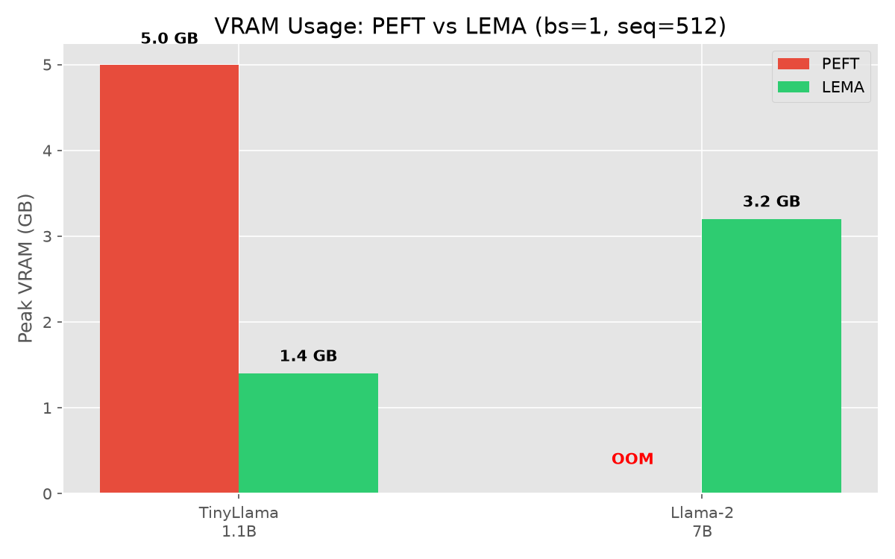
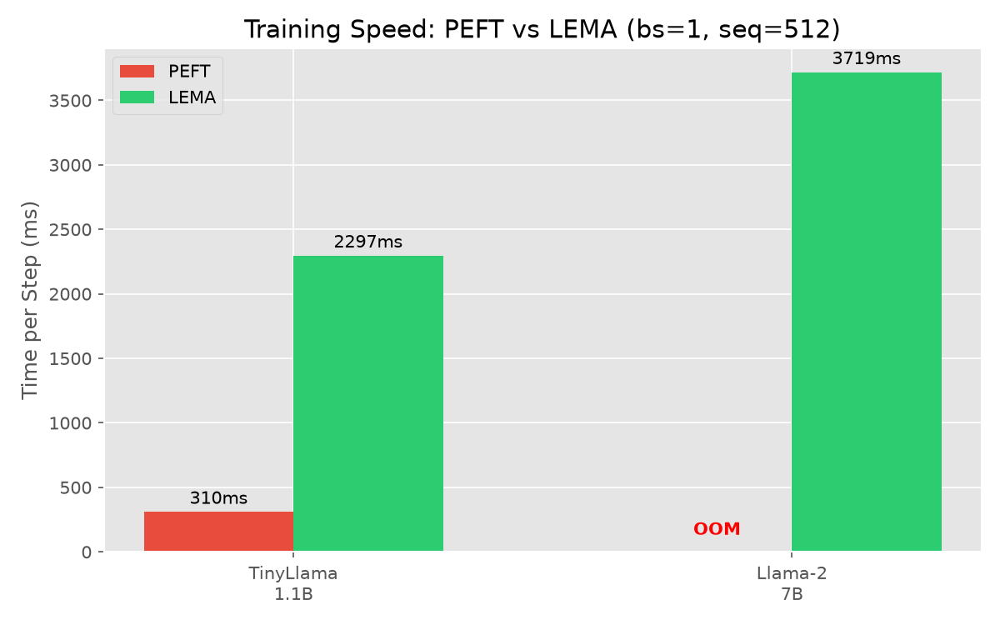
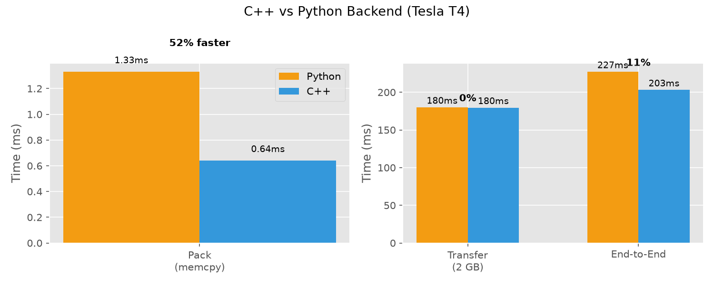
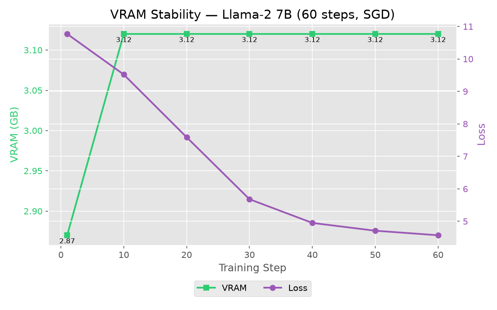
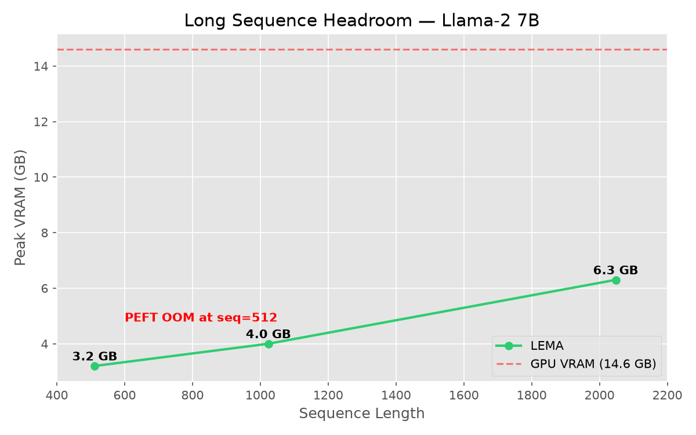
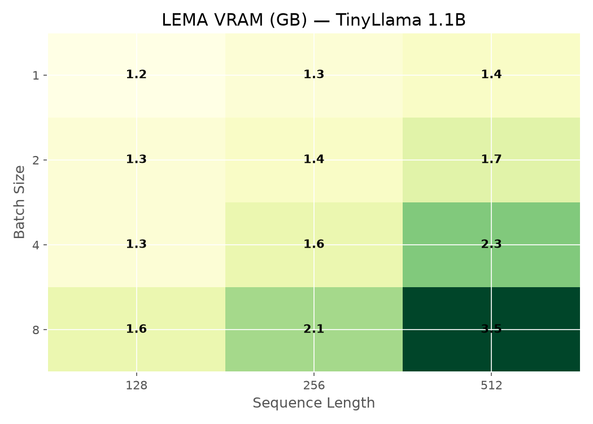

# Benchmark Results

All benchmarks run on **Tesla T4 (14.6 GB VRAM)** via Kaggle notebook. Run the notebook at `examples/kaggle/benchmark.ipynb`.

## LEMA Configuration

All LEMA benchmarks use the following configuration unless otherwise noted:

| Parameter | Value |
|---|---|
| `backend` | `"auto"` (C++ compiled, Python fallback if CUDA unavailable) |
| `strategy` | `STREAMING` (weights loaded on-demand from disk) |
| `max_ram_gb` | auto (70% of system RAM, ~21.9 GB) |
| `max_vram_gb` | auto (60% of GPU VRAM, ~8.7 GB) |
| `vram_fraction` | 0.8 (PyTorch capped to 80% of total VRAM) |
| `prefetch_distance` | 2 (2 layers ahead prefetched) |
| `lora_rank` | 16 |
| `lora_alpha` | 32 |
| `lora_target_modules` | `[q_proj, k_proj, v_proj, o_proj, gate_proj, up_proj, down_proj]` |
| `gradient_checkpointing` | `True` |
| `dtype` | auto (bf16 for TinyLlama, fp16 for Llama-2 7B) |
| Module pool | 3 slots (1 embedding, 1 decoder block, 1 head) — recycled per step |
| VRAM buffers | 2 flat buffers (double-buffered), size = max layer params |
| RAM buffers | 2 streaming slots (1000, 1001), pinned memory |

TinyLlama 1.1B has 24 decoder layers (~2.05 GB bf16). Llama-2 7B has 34 decoder layers (~13.5 GB fp16). STREAMING keeps only 2 layers in VRAM at any time — the current compute layer and the next prefetched layer.

## VRAM Comparison (bs=1, seq=512)

| Model | PEFT VRAM | LEMA VRAM | Savings |
|---|---|---|---|
| TinyLlama 1.1B | 5.0 GB | 1.4 GB | 72% |
| Llama-2 7B | OOM | 3.2 GB | LEMA only |

## Training Speed (bs=1, seq=512)

| Model | PEFT | LEMA | Ratio |
|---|---|---|---|
| TinyLlama 1.1B | 310 ms | 2297 ms | 7.4x |
| Llama-2 7B | OOM | 3719 ms | -- |

LEMA's triple-buffer pipeline (disk -> RAM -> VRAM) adds throughput overhead. On models that fit in VRAM, PEFT is faster. On models that don't, LEMA makes training possible where PEFT OOMs.

## C++ Backend Performance

| Operation | Python | C++ | Improvement |
|---|---|---|---|
| Pack (memcpy, 8 layers) | 1.33 ms | 0.64 ms | 52% faster |
| Transfer + sync (32 MB) | 2.84 ms | 2.84 ms | ~0% |
| Transfer + sync (2 GB) | 180.0 ms | 179.5 ms | ~0% |
| End-to-end train step | 227.1 ms | 203.0 ms | 10.6% faster |

C++ improvement is limited to CPU-side packing (memcpy). GPU transfers are PCIe-bound and see no benefit.

## Memory Strategy: RESIDENT vs STREAMING

| Strategy | Load Time | Step Time | VRAM |
|---|---|---|---|
| RESIDENT | 6.6 s | 2374 ms | 1.4 GB |
| STREAMING | 2.3 s | 2465 ms | 1.4 GB |

(TinyLlama 1.1B -- VRAM difference is negligible at this model size. On 7B+, STREAMING saves significant VRAM.)

## VRAM Stability (60 steps on Llama-2 7B)

| Step | VRAM | Loss |
|---|---|---|
| 1 | 2.87 GB | 10.77 |
| 10 | 3.12 GB | 9.52 |
| 20 | 3.12 GB | 7.59 |
| 30 | 3.12 GB | 5.68 |
| 40 | 3.12 GB | 4.95 |
| 50 | 3.12 GB | 4.71 |
| 60 | 3.12 GB | 4.57 |

VRAM settled at 3.12 GB after initial load and remained flat. Drift over 60 steps: +0.24 GB (all from step 1 cold start). Training uses SGD and converges stably.

## Long Sequence Headroom (Llama-2 7B)

| Seq Len | PEFT | LEMA VRAM | LEMA Step Time |
|---|---|---|---|
| 512 | OOM | 3.2 GB | 3662 ms |
| 1024 | OOM | 4.0 GB | 4975 ms |
| 2048 | OOM | 6.3 GB | 8414 ms |
| 4096 | OOM | OOM | -- |

LEMA reaches 2048 vs PEFT's 512 on a 14.6 GB T4 -- a 4x improvement in usable sequence length.

## VRAM Scaling (TinyLlama 1.1B, full matrix)

| Seq | Batch | PEFT ms | PEFT VRAM | LEMA ms | LEMA VRAM |
|---|---|---|---|---|---|
| 128 | 1 | 205 | 2.8 GB | 935 | 1.2 GB |
| 128 | 4 | 235 | 4.5 GB | 2243 | 1.3 GB |
| 128 | 8 | 458 | 6.8 GB | 4642 | 1.6 GB |
| 256 | 8 | 944 | 11.1 GB | 9776 | 2.2 GB |
| 512 | 1 | 310 | 5.0 GB | 2297 | 1.4 GB |
| 512 | 4 | 1091 | 12.9 GB | 9825 | 2.4 GB |
| 512 | 8 | OOM | -- | 21087 | 3.5 GB |

## CPU Offload Comparison (TinyLlama 1.1B)

| Method | Step Time | VRAM |
|---|---|---|
| HF CPU Offload | 298 ms | 2.4 GB |
| LEMA Streaming | 2390 ms | 1.4 GB |

CPU offload is faster when the model fits in VRAM. LEMA's streaming advantage appears at 7B+ scale where repeated CPU-GPU transfers dominate.
