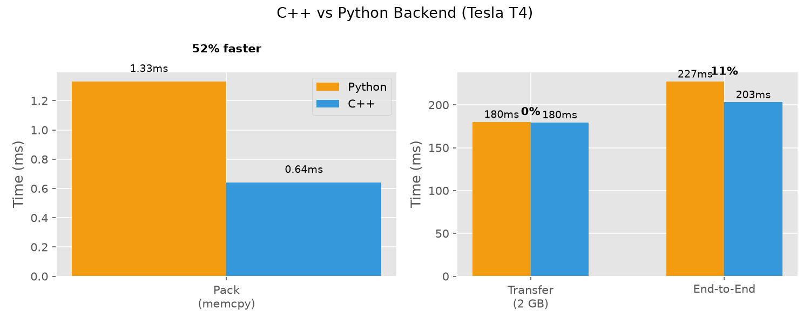
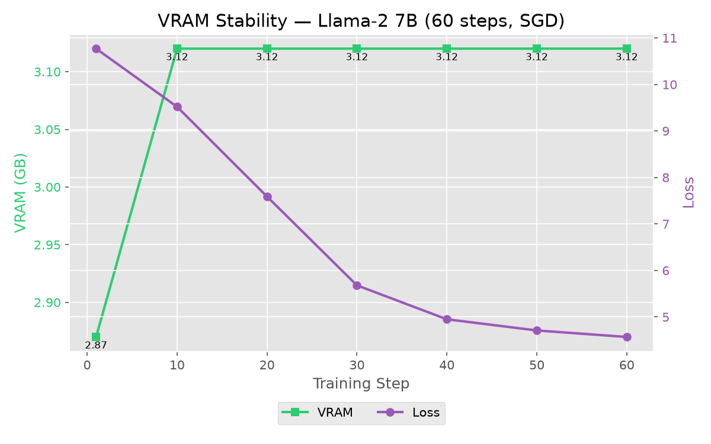
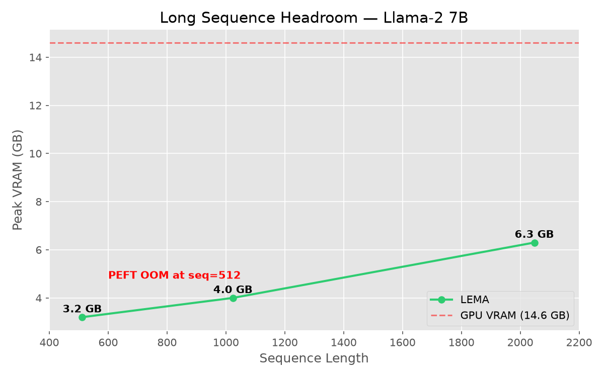
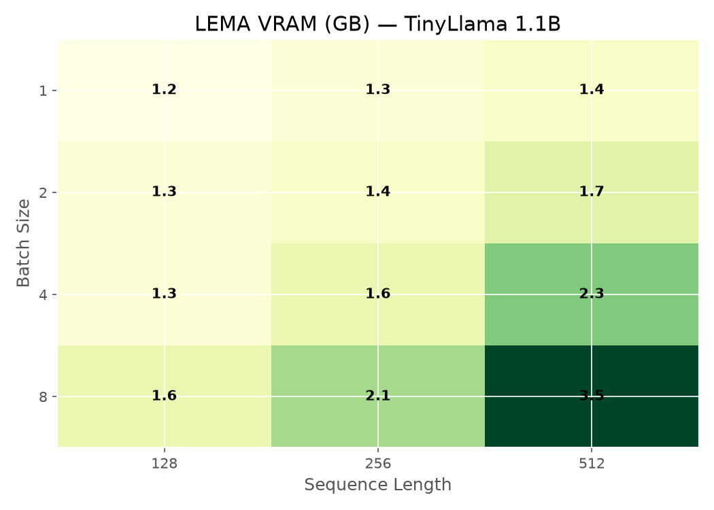

# Benchmark Results

All benchmarks run on **Tesla T4 (14.6 GB VRAM)** via Kaggle notebook. Run the notebook at `examples/kaggle/benchmark.ipynb`.

## LEMA Configuration

All LEMA benchmarks use the following configuration unless otherwise noted:

| Parameter | Value |
|---|---|
| `backend` | `"auto"` (C++ compiled, Python fallback if CUDA unavailable) |
| `strategy` | `STREAMING` (weights loaded on-demand from disk) |
| `max_ram_gb` | auto (70% of system RAM, ~21.9 GB) |
| `max_vram_gb` | auto (60% of GPU VRAM, ~8.7 GB) |
| `vram_fraction` | 0.8 (PyTorch capped to 80% of total VRAM) |
| `prefetch_distance` | 2 (2 layers ahead prefetched) |
| `lora_rank` | 16 |
| `lora_alpha` | 32 |
| `lora_target_modules` | `[q_proj, k_proj, v_proj, o_proj, gate_proj, up_proj, down_proj]` |
| `gradient_checkpointing` | `True` |
| `dtype` | auto (bf16 for TinyLlama, fp16 for Llama-2 7B) |
| Module pool | 3 slots (1 embedding, 1 decoder block, 1 head) — recycled per step |
| VRAM buffers | 2 flat buffers (double-buffered), size = max layer params |
| RAM buffers | 2 streaming slots (1000, 1001), pinned memory |

TinyLlama 1.1B has 24 decoder layers (~2.05 GB bf16). Llama-2 7B has 34 decoder layers (~13.5 GB fp16). STREAMING keeps only 2 layers in VRAM at any time — the current compute layer and the next prefetched layer.

## VRAM Comparison (bs=1, seq=512)

| Model | PEFT VRAM | LEMA VRAM | Savings |
|---|---|---|---|
| TinyLlama 1.1B | 5.0 GB | 1.4 GB | 72% |
| Llama-2 7B | OOM | 3.2 GB | LEMA only |

## Training Speed (bs=1, seq=512)

| Model | PEFT | LEMA | Ratio |
|---|---|---|---|
| TinyLlama 1.1B | 310 ms | 2297 ms | 7.4x |
| Llama-2 7B | OOM | 3719 ms | -- |

LEMA's triple-buffer pipeline (disk -> RAM -> VRAM) adds throughput overhead. On models that fit in VRAM, PEFT is faster. On models that don't, LEMA makes training possible where PEFT OOMs.

## C++ Backend Performance

| Operation | Python | C++ | Improvement |
|---|---|---|---|
| Pack (memcpy, 8 layers) | 1.33 ms | 0.64 ms | 52% faster |
| Transfer + sync (32 MB) | 2.84 ms | 2.84 ms | ~0% |
| Transfer + sync (2 GB) | 180.0 ms | 179.5 ms | ~0% |
| End-to-end train step | 227.1 ms | 203.0 ms | 10.6% faster |

C++ improvement is limited to CPU-side packing (memcpy). GPU transfers are PCIe-bound and see no benefit.

## Memory Strategy: RESIDENT vs STREAMING

| Strategy | Load Time | Step Time | VRAM |
|---|---|---|---|
| RESIDENT | 6.6 s | 2374 ms | 1.4 GB |
| STREAMING | 2.3 s | 2465 ms | 1.4 GB |

(TinyLlama 1.1B -- VRAM difference is negligible at this model size. On 7B+, STREAMING saves significant VRAM.)

## VRAM Stability (60 steps on Llama-2 7B)

| Step | VRAM | Loss |
|---|---|---|
| 1 | 2.87 GB | 10.77 |
| 10 | 3.12 GB | 9.52 |
| 20 | 3.12 GB | 7.59 |
| 30 | 3.12 GB | 5.68 |
| 40 | 3.12 GB | 4.95 |
| 50 | 3.12 GB | 4.71 |
| 60 | 3.12 GB | 4.57 |

VRAM settled at 3.12 GB after initial load and remained flat. Drift over 60 steps: +0.24 GB (all from step 1 cold start). Training uses SGD and converges stably.

## Long Sequence Headroom (Llama-2 7B)

| Seq Len | PEFT | LEMA VRAM | LEMA Step Time |
|---|---|---|---|
| 512 | OOM | 3.2 GB | 3662 ms |
| 1024 | OOM | 4.0 GB | 4975 ms |
| 2048 | OOM | 6.3 GB | 8414 ms |
| 4096 | OOM | OOM | -- |

LEMA reaches 2048 vs PEFT's 512 on a 14.6 GB T4 -- a 4x improvement in usable sequence length.

## VRAM Scaling (TinyLlama 1.1B, full matrix)

| Seq | Batch | PEFT ms | PEFT VRAM | LEMA ms | LEMA VRAM |
|---|---|---|---|---|---|
| 128 | 1 | 205 | 2.8 GB | 935 | 1.2 GB |
| 128 | 4 | 235 | 4.5 GB | 2243 | 1.3 GB |
| 128 | 8 | 458 | 6.8 GB | 4642 | 1.6 GB |
| 256 | 8 | 944 | 11.1 GB | 9776 | 2.2 GB |
| 512 | 1 | 310 | 5.0 GB | 2297 | 1.4 GB |
| 512 | 4 | 1091 | 12.9 GB | 9825 | 2.4 GB |
| 512 | 8 | OOM | -- | 21087 | 3.5 GB |

## CPU Offload Comparison (TinyLlama 1.1B)

| Method | Step Time | VRAM |
|---|---|---|
| HF CPU Offload | 298 ms | 2.4 GB |
| LEMA Streaming | 2390 ms | 1.4 GB |

CPU offload is faster when the model fits in VRAM. LEMA's streaming advantage appears at 7B+ scale where repeated CPU-GPU transfers dominate.

## Selective Full Fine-Tuning (TinyLlama 1.1B)

Selection: q/k/v/o projections of the last 4 decoder layers (37.7M params, ~3.4% of the 1.1B model), trained under `STREAMING` with fp32 states in RAM. Verified in the Kaggle notebook's full-FT demo cells (all modes) on a T4.

| Metric | Value |
|---|---|
| Selected params | 37,748,736 (~3.4% of 1.1B; GQA: 4 KV heads vs 32 Q heads) |
| fp32 state footprint | ~0.151 GB (true weights + Adam moments) |
| VRAM (constant) | **0.75 GB** |
| RAM | ~4.9 GB |
| Step time | ~1.1–1.6 s (seq=64) |
| Loss (6 steps) | 13.56 → 4.69 |
| Resume (delta + optimizer restore) | weights match exactly; training continues (loss 4.69 → 3.77) |

Other verified full-FT modes (tiny GPT-2, CUDA): whole-model (LOMO-style), emb/head-only, disk gradient-accumulation backend, gradient-accumulation boundaries (`accum_steps=2` steps only at the boundary), and checkpoint → `merge_delta` → restore → resume.

The full-FT selection triple (`trainable_modules` × `trainable_layers`) supports arbitrary subsets up to whole-model fine-tuning; VRAM stays at the single-layer working set while RAM scales with the selected parameter count.

## TensorStore Umbrella (T4)

The unified streaming core: weights, optimizer states, gradient accumulators, and KV chunks all live in one `TensorStore` with per-kind VRAM budgets (tuner proposes, explicit overrides win) and a target-based `BudgetEngine`. Verified in the Kaggle notebook's TensorStore demo cell on a T4 (seq=64 > one 16-token KV chunk).

| Check | Result |
|---|---|
| Chunked attention (32 keys, 8/chunk) vs full | max diff **1.79e-07** (exact) |
| Chunked long-context forward (GPT-2, seq=64) vs full | max diff **1.19e-07** (exact) |
| KV-cached generation vs old O(n²) re-forward | identical token output |
| Budget tuning | per-kind VRAM: weights/kv/opt/grad = 2.0 GB each (8 GB budget), target met |
| Full unit suite | 76/76 passing (local + Kaggle) |

KV-cached generation (`generate_kv`) streams per-layer KV chunks through the store, enabling long-context inference without holding the full KV cache in VRAM; chunked attention is exact (online softmax in fp32), not an approximation.

## Quantization Support (T4)

Per-kind quantization (`weights_bits`/`opt_state_bits`/`grad_acc_bits`/`kv_bits`; int8, plus int4 for weights) with symmetric integer + fp32 scale, quantized bytes crossing disk/RAM/PCIe and dequant at consumption. Verified in the Kaggle notebook's quant demo cell on a T4 — selective full-FT on TinyLlama 1.1B, last 2 layers q/k/v/o, 2 steps, fp16 baseline vs int8-all.

| Metric | fp16 baseline | int8-all |
|---|---|---|
| Loss | 13.19 → 12.19 | 12.88 → 11.88 |
| Step time | 2.72 s / 0.98 s | 21.3 s / 18.1 s |
| Peak VRAM | 0.76 GB | 1.43 GB |
| Peak RSS | 4.91 GB | 5.56 GB |

Findings (honest trade-offs, now reflected in README/USER_GUIDE):

- **Storage savings are in RAM/disk/PCIe, not VRAM**: quantized weight streams cut RAM/disk footprint ~2x (int8) / 4x (int4-weights), but the weight path keeps a fp32 dequant slot per VRAM slot, so peak VRAM rises (0.76 → 1.43 GB here). Full-FT optimizer states / accumulators / KV chunks quantize their on-RAM and on-disk representations.
- **int8 weights are lossy at load**: first-loss gap vs baseline ~0.31 (real weights), so per-step training dynamics differ slightly.
- **On-the-fly quantize adds real per-step cost**: CPU-side per-row quantize at pack time dominates on CPU-starved hosts (see the W8A8 section below — use pre-quantized checkpoints for streaming full-FT). int8-weights-only is the cheapest option.

Full unit suite 137/137 passing (local + Kaggle), including the all-four-bits end-to-end train smoke test.

## W8A8 Native Int8 Compute

`weights_bits=8` with native kernels (AVX2 on CPU, DP4A on CUDA, compiled automatically) streams raw int8 weight buffers into int8×int8→int32 GEMM kernels with a fused scale epilogue — no fp32 dequant slot on the hot path for llama decoder layers. Weight bytes halve across disk, RAM, PCIe, and VRAM simultaneously.

CPU kernel benchmark (2048×4096×4096, 6-core/12-thread box, bit-exact vs fp32 reference): native AVX2 int8 GEMM 0.304 s vs torch fp32 matmul 0.367 s (0.83x — faster than fp32). Gated by `tests/test_w8a8_benchmark.py`.

T4 end-to-end (TinyLlama 1.1B, selective full-FT last:2 q/k/v/o, 2 steps, Kaggle T4 — `HAS_NATIVE True`, `USE_CUDA True`):

**Transfer (RAM→VRAM, one layer = 22.0M params, 88.1 MB fp16, measured after the exact-byte transfer fix):**

| Precision | Buffer | Time | Throughput |
|---|---|---|---|
| fp16 | 88.1 MB | 8.57 ms | 10.3 GB/s |
| int8 (W8A8, on-fly) | 44.0 MB | 4.63 ms | 9.5 GB/s |
| int8 (pre-quantized) | 44.0 MB | 4.57 ms | 9.6 GB/s |

Transfer bytes halve (2.0× reduction, 88.1→44.0 MB) and wall time halves with them: both paths now move only the exact payload and sit at PCIe 3.0 x16 wire saturation (~10 GB/s pinned). Pre-fix, every transfer moved the full fp16-sized staging buffer (131 MB) with a dtype-cast penalty, which printed as a misleading 3.1 GB/s "throughput".

**Training step (TinyLlama 1.1B, selective full-FT last:2, seq=64, Kaggle T4):**

| Metric | fp16 baseline | int8-W8A8 on-fly | int8-W8A8 pre-quantized | int4-W4A16 pre-quantized |
|---|---|---|---|---|
| Loss (2 steps) | 12.94 → 11.88 | ~15–16 s/step, 0.06× | 13.44 → 12.38 (Δ1.06) | 13.00 → 11.56 |
| Sustained step | ~0.8–1.3 s | ~15 s (pack_wait 87–88%) | 0.79–1.26 s (pack_wait 0.4%) | 1.17–1.61 s (pack_wait <1%) |
| Peak VRAM | 0.76 GB | 1.23 GB | −520 MB vs fp16 | −552 MB vs fp16 |

**Honest findings (corrected after step-time profiling and pre-quant verification):**

- **On-the-fly quantization is CPU-bound at pack time:** on 2-vCPU hosts ~83–88% of the W8A8 step is `pack_wait` — CPU per-row quantize of ~131 MB/layer stalling the prefetch pipeline. This made on-fly W8A8 15–20× slower than fp16. The int8 GEMM itself is a minor cost (~196 ms/step on sm_75).
- **Pre-quantized checkpoints eliminate the bottleneck:** packing becomes a raw byte copy (`pack_wait` 12.4 s → 4 ms). int8 pre-quantized full-FT runs at fp16 parity on sustained steps (~1.26 s vs ~1.27 s fp16 wall, 3-step breakdown) with −520 MB VRAM, and learns at the fp16 rate (Δloss 1.06 vs 1.06 over two steps). int4 pre-quantized runs ~0.7× with −552 MB.
- **Storage/PCIe win is real and now reaches the wire:** weight bytes halve across disk, RAM, PCIe, and VRAM (2.0×), and transfer wall time halves with them (9.5–10.3 GB/s ≈ wire saturation). The training-correctness bug where phase-2 native modules re-quantized updated weights (making int8 full-FT ~15× slower to learn) is fixed; all full-FT phases use dequantized modules.
- **Remaining per-step cost is construct/materialization** (~530–550 ms, 34–42% of wall in both phases), not quantization — fp16 streaming pays a similar structural cost. Optimization targets (phase-2 skip, same-layer re-transfer elision, fused dequant) are tracked separately.
- **Correctness is sound:** loss advances every step, transfer byte reduction asserted, W8A8 forward bit-exact vs fp32 reference in unit tests (192 passed + 1 skipped full suite).

## Quantization Backends (parity and fallback behavior)

All four registered backends (`custom`, `torchao`, `quanto`, `bitsandbytes`) were exercised in the Kaggle benchmark (quanto/bnb installed in the notebook's setup cell) and in the local CPU suite. `quant_backend` only affects on-the-fly streamed-weight quantization; every backend must emit the engine's wire format (int8 codes + per-row fp32 scale for bits=8, packed uint4 nibbles + per-row scale for bits=4), and the engine's dequantizer is shared.

**Weight-quant parity (TinyLlama `q_proj` 2048×2048, GPU, pack/transfer/accuracy bench):**

| Backend | bits=8 rel-err | bits=8 wire | bits=4 rel-err | bits=4 wire | Notes |
|---|---|---|---|---|---|
| custom (reference) | 0.0039 | 4.20 MB | 0.0714 | 2.11 MB | per-row symmetric RTN |
| torchao | 0.0039 (bit-identical to custom) | 4.20 MB | → custom | 2.11 MB | bits=4 is an explicit, warned fallback |
| quanto | → custom on CUDA | 4.20 MB | → custom | 2.11 MB | native path verified on CPU; CUDA path warns ("1D Tensors cannot be quantized per-axis") and falls back |
| bitsandbytes | → custom on CUDA | 4.20 MB | → custom | 2.11 MB | native path verified on CPU (`int8_vectorwise_quant`); CUDA path warns (IndexError) and falls back |

Key facts:

- **bits=8 on CPU is a real per-backend path** for torchao/quanto/bitsandbytes — verified by instrumented unit tests that spy on the backend's own quantize calls (31 native calls per full train step for both quanto and bitsandbytes), not silent fallbacks.
- **bits=4 is custom-only by construction**: quanto/bnb int4 formats (quanto qint4, bnb NF4 with blockwise absmax) are incompatible with the engine's shared dequantizer (NF4 is LUT-index codes + blockwise scales, not int4 two's-complement + per-row scale). Attempting them warns once and falls back to the custom quantizer — previously bnb bits=4 silently produced garbage, now impossible.
- **On CUDA, quanto/bnb bits=8 also fall back to custom** with a logged warning (quanto's per-axis API rejects the engine's per-row layout; bnb's vectorwise API raises on the engine's tensor shapes). The fallback emits byte-identical wire format, so accuracy and transfer behavior are exactly custom's.
- **Training sweep (bits=8, on-fly, Kaggle T4):** all four backends train, but every backend inherits the same CPU pack_wait bottleneck (~15–16 s/step, 0.06× fp16) because the effective quantizer is custom on GPU for quanto/bnb — pre-quantized checkpoints are the fix regardless of backend.
- `auto` backend resolution prefers torchao → quanto → bitsandbytes → custom; explicit invalid combos never crash, they warn (deduplicated) and fall back.
